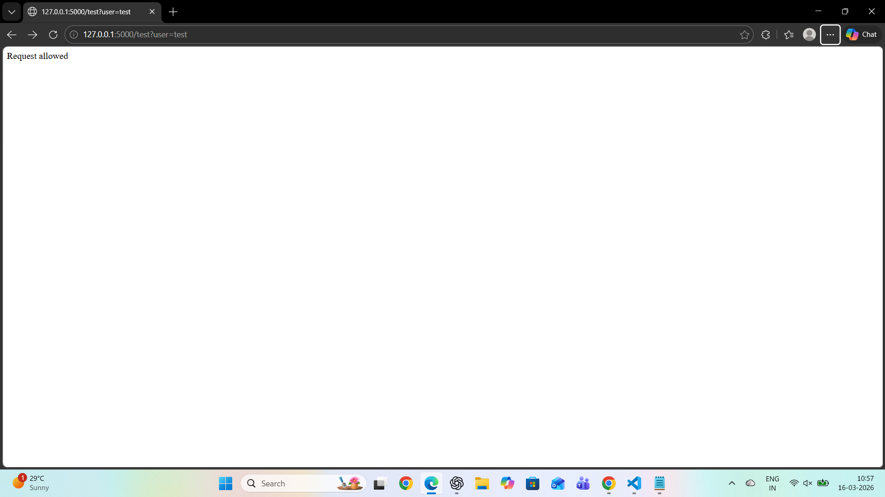
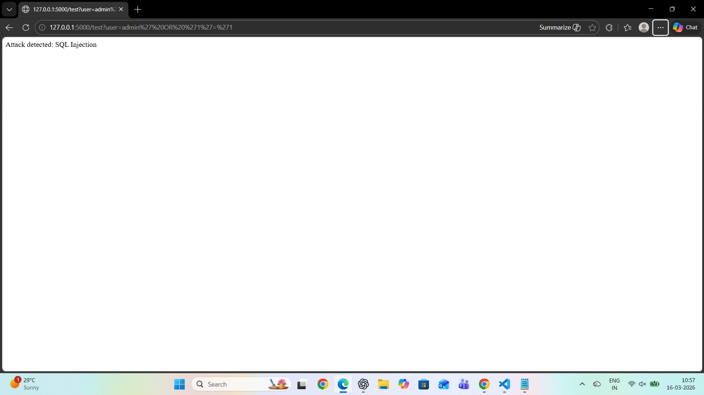
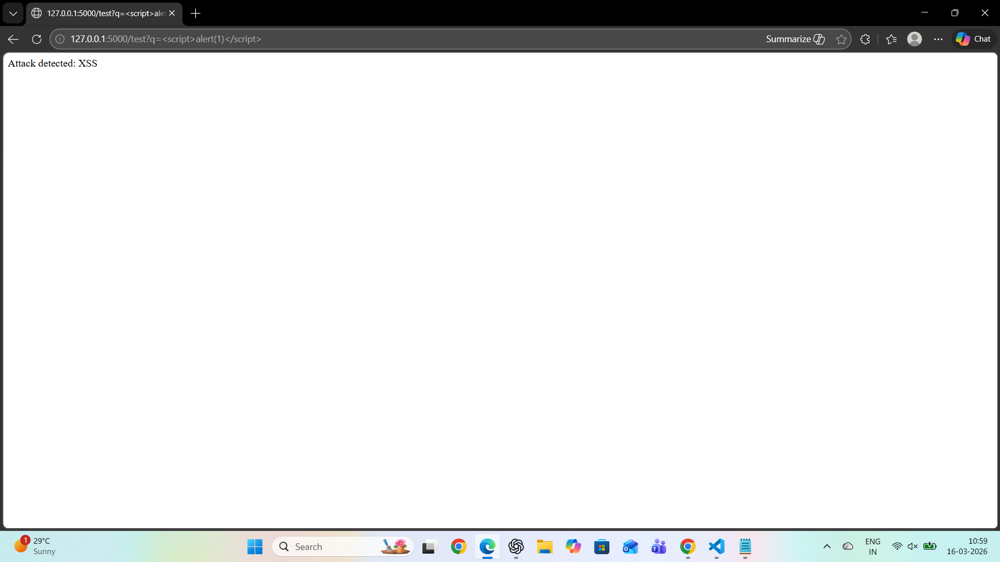
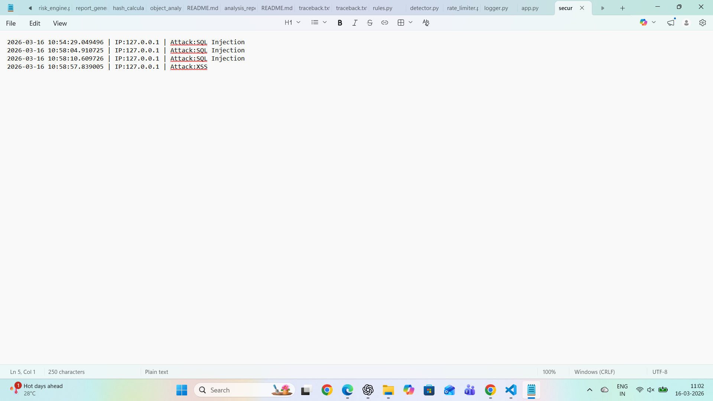
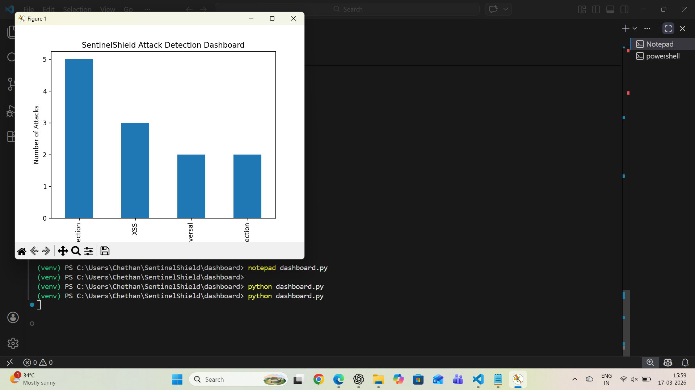

# 🛡️ SentinelShield – Advanced Intrusion Detection System

🔐 Simulates a real-world Web Application Firewall (WAF) to detect, analyze, and prevent common web attacks in real-time.

🚀 A lightweight **Web Application Firewall (WAF)** and **Intrusion Detection System (IDS)** built using Python and Flask.

SentinelShield monitors incoming HTTP requests, detects malicious patterns such as SQL Injection and XSS, applies rate limiting to prevent abuse, logs security events, and visualizes attack data through a dashboard.

---

## 🔥 Key Highlights

* 🚨 Detects SQL Injection, XSS, LFI, Command Injection, Directory Traversal
* ⚡ Implements rate limiting to prevent brute-force and flooding attacks
* 📄 Logs all malicious activity with timestamp and IP tracking
* 🧪 Automated attack simulation for realistic testing
* 📊 Dashboard visualization of attack trends

---

## 🎬 Quick Demo

1. Start the server  
2. Send a normal request → allowed  
3. Send a malicious request → detected  
4. Repeated requests → blocked  
5. View logs and dashboard for analysis  

---

## 📸 Output Screenshots

### 🔹 Server Running


### 🔹 Normal Request



### 🔹 SQL Injection Detection



### 🔹 XSS Detection



### 🔹 Logs



### 🔹 Dashboard



---

## ⚙️ Installation & Setup

### 1️⃣ Clone Repository

```bash
git clone https://github.com/surabathinichethan-star/SentinelShield-Advanced-Intrusion-Detection-System.git
cd SentinelShield-Advanced-Intrusion-Detection-System

---

### 2️⃣ Create Virtual Environment

python -m venv venv
venv\Scripts\activate

---

### 3️⃣ Install Dependencies

pip install -r requirements.txt

---

## ▶️ How to Run

### 🔹 Start Server

python app.py

Open in browser:
http://127.0.0.1:5000

---

### 🔹 Run Attack Simulator

python tests/attack_simulator.py

---

### 🔹 Run Dashboard

cd dashboard
python dashboard.py

---

## 📊 Sample Output

* Request allowed for normal traffic
* Attack detected for malicious payloads
* IP blocked after excessive requests
* Logs generated with timestamps and attack types
* Dashboard shows attack distribution

---

## 📁 Project Structure

SentinelShield
│
├── app.py
├── detector.py
├── rules.py
├── rate_limiter.py
├── logger.py
├── requirements.txt
├── README.md
│
├── logs/
├── tests/
├── dashboard/
├── screenshots/

---

## 🧠 System Workflow

📥 Client Request  
→ 🔍 Request Analysis  
→ 🚨 Attack Detection  
→ ⚡ Rate Limiting  
→ 📝 Logging  
→ 📊 Dashboard Visualization  

## 📊 Results

- Successfully detected SQL Injection and XSS attacks  
- Blocked excessive requests using rate limiting  
- Logged malicious activity with IP tracking  
- Visualized attack distribution using dashboard  

## ⚠️ Limitations

* Signature-based detection only
* Cannot detect unknown or zero-day attacks
* Possible false positives

---

## 🔮 Future Improvements

* 🤖 Machine Learning-based anomaly detection
* 🌍 Geo-IP filtering
* 📡 Real-time web dashboard integration
* 🔐 Automated response system

---

## 🧰 Tech Stack

- Python  
- Flask  
- Pandas  
- Matplotlib  

## 🌍 Real-World Applications

- Web Application Firewalls (WAF)  
- Security Operations Center (SOC) monitoring  
- Threat detection systems  
- Intrusion detection environments  

## 🎯 Conclusion

SentinelShield demonstrates how modern web security systems detect and respond to cyber threats using rule-based detection, behavioral analysis, and data visualization.

This project provides hands-on experience in:

* Intrusion Detection Systems (IDS)
* Web Application Security
* Log Analysis
* Security Monitoring

## 🛠️ Skills Demonstrated

- Web Security Fundamentals  
- Intrusion Detection Systems (IDS)  
- Python Development  
- Log Analysis  
- Data Visualization  
- Cybersecurity Concepts  

## 🎯 Why This Project

Web applications are frequent targets of cyber attacks. This project demonstrates how security systems detect malicious requests, prevent abuse, and provide visibility into threats.

---

## 👨‍💻 Author

**Chethan Surabathini**

---

## ⭐ If you found this project useful, consider giving it a star!